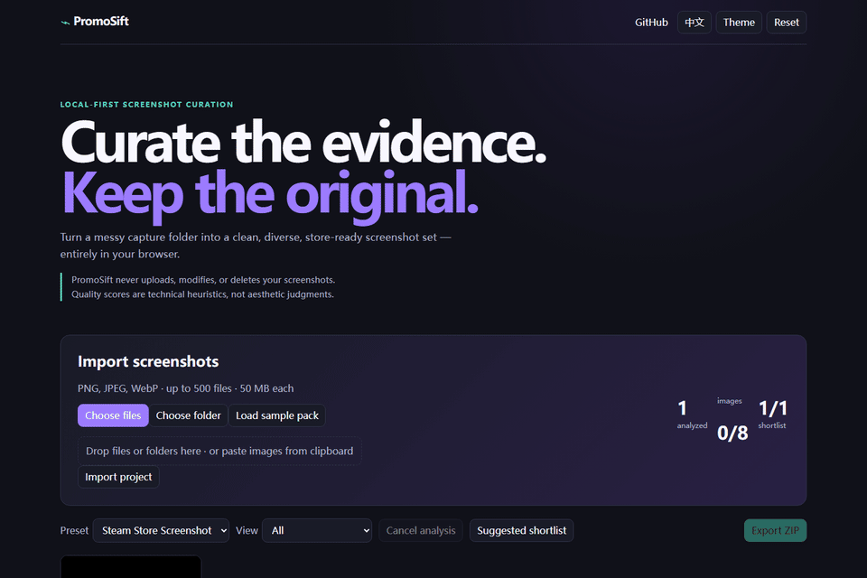
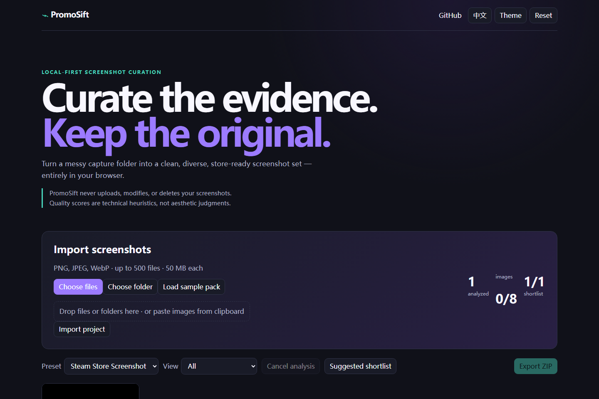

#  PromoSift

> Turn a messy folder of gameplay captures into a clean, diverse, store-ready screenshot set — entirely in your browser.

[](https://github.com/KanadeK/promosift/actions/workflows/ci.yml) [](https://kanadek.github.io/promosift/) [](https://github.com/KanadeK/promosift/releases) [](LICENSE) · [中文](README.zh-CN.md)





## Why

PromoSift helps game teams review a large capture folder without sending it anywhere. It finds technical review signals and keeps editorial choices entirely in your hands.

**PromoSift never uploads, modifies, or deletes your screenshots.**

**Quality scores are technical heuristics, not aesthetic judgments.**

A dark, low-contrast, or visually similar screenshot may still be the correct creative choice. Always review results manually before publishing.

## Demo

Load the built-in synthetic sample pack in the app. It includes clear, blurry, dark, bright, blank, portrait, wrong-ratio, duplicate, pixel-art, and night-scene examples. [Live demo](https://kanadek.github.io/promosift/)

## Features

- Local PNG, JPEG, and WebP import: file picker, folder picker, drag-and-drop, and clipboard paste.
- Steam Store Screenshot, generic 16:9/4:3, and configurable browser-local analysis primitives.
- Resolution, aspect-ratio, blur-like variance, brightness, clipping, contrast, and near-blank review suggestions.
- SHA-256 exact-file detection plus 64-bit dHash visual duplicate clustering.
- Explainable color-histogram diversity hints and a manually overridable Suggested shortlist.
- Keep / Maybe / Reject workflow with draggable shortlist ordering.
- Original-byte ZIP export, CSV report, JSON project record (no image data), and Canvas contact sheet.

## Quick Start

```bash
npm ci
npm run fixtures
npm run dev
```

Open the shown localhost URL. Nothing is uploaded; the worker decodes and analyzes each selected file inside your browser.

## Supported Formats

PNG, JPEG, and WebP. PromoSift accepts at most 500 files, up to 50 MB per file, and warns when the import totals more than 2 GB.

## Quality Checks

The app uses a resized grayscale Laplacian variance as a relative blur signal; luminance distribution for dark/bright/clipping/contrast signals; and color variance for near-blank frames. It says “Review suggested,” not “bad image.” See [algorithm limitations](docs/algorithms.md).

## Duplicate Detection

Exact duplicate files use SHA-256. Perceptual dHash groups visually near or similar frames by Hamming distance. It is deliberately a prompt to compare—not an automatic deletion tool.

## Steam Preset

The Steam Store Screenshot preset expects 16:9 at 1920×1080 or larger. Correct size and ratio passes; close ratios warn; small, portrait, unreadable, or incorrect-ratio images fail.

## Shortlist Workflow

Review cards, mark Keep / Maybe / Reject, optionally use **Suggested shortlist**, then reorder the Keep list with drag-and-drop. Suggested shortlist never overrides manual review.

## Export Format

`promosift-selection.zip` contains `selected/` originals, `contact-sheet.png`, `selection.json`, `report.csv`, and `README.txt`. The project JSON stores only hashes, metrics, choices, ordering, and configuration—never image Base64 or device paths.

## Privacy

No accounts, analytics, API calls, remote fonts, uploads, or cloud persistence. Read [privacy details](docs/privacy.md).

## Algorithm Limitations

Pixel art, intentionally dark scenes, loading frames, very minimal art, and UI-heavy captures can trigger useful but incorrect review suggestions. PromoSift does not inspect game content and does not make aesthetic judgments.

## Local Development

```bash
npm run dev
npm run build
npm run preview
```

## Testing

```bash
npm run check
npm run test:e2e
```

## Roadmap

- Import custom screenshot requirement presets.
- Add itch.io and social-media presets.
- Compare two shortlisted screenshot sets.

## Contributing

See [CONTRIBUTING.md](CONTRIBUTING.md). Bug reports for false positives are especially useful.

## License

[MIT](LICENSE).
